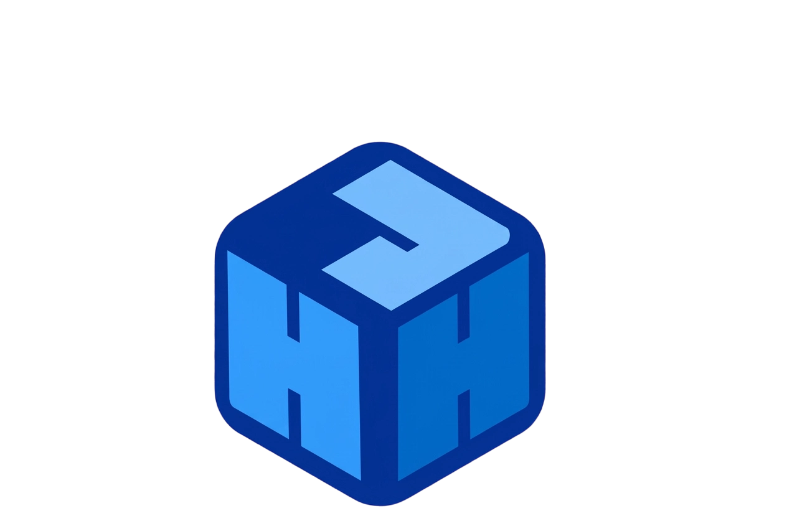

# AgentForge（智能体工坊）



> **多智能体客户端管理器 · 已适配 Trae / TraeWork / WorkBuddy（各含国际版与国内版）**
>
> 面向智能体客户端的一站式本地管理基座：账号、设备、对话上下文、自动化，全在一个工具里。
>
> 核心能力：**多账号来回切换，任务进展与工作状态都还在。**

> [!IMPORTANT]
> **本仓库为发布与文档仓库，不含源代码。** 软件以安装包形式发布，请从 [Releases](https://github.com/Ylsssq926/AgentForge/releases) 获取。

本项目的前作为 **TraeReset**（一款 Trae 环境重置工具）。AgentForge 是在其经验基础上
完全重写的新一代产品：从「单一重置脚本」重构为「多客户端账号与设备管理基座」，
前后端架构、平台适配层、切换策略与数据保护机制均为重新设计实现。

## 功能特性

### 账号管理

- **从本机客户端一键导入**：自动检测本机已登录的客户端（Trae / TraeWork / WorkBuddy，各含国际版与国内版），点一下即可导入，无需重新登录；同账号多客户端自动识别（「同一账号」「已导入」标记），支持**批量导入**
- **灵活切换（默认）**：换掉设备特征（机器码、遥测 ID、登录凭证、Cookies），**保留工作成果**——编辑器布局、会话草稿、模型选择、Git 状态、终端历史、项目列表。多账号来回切换，做过的事都还在
- **多开实例**：同一客户端多开多个已登录实例，各自独立数据目录与设备指纹
- **本地对话数据按账号隔离**（可选）：切走时把该账号的本地对话库收进专属槽位，切回原样取回，账号之间不再互相覆盖（同盘移动，秒级完成）
- **换机迁移**：导出完整备份（含登录凭据），新电脑导入直接可用；对话数据可单独导出导入

### 自动化

- **定时自动签到**：每天到点自动用真实客户端完成签到（同账号积分共享只签一次；错过时间会在下次启动后自动补签）
- **用量采样与积分预警**：后台记录积分用量，估算消耗速率，剩余不多时在卡片上显示「约 N 天后见底」，并以量条直观呈现剩余额度
- **开机自动启动**：后台静默常驻，Token 刷新与定时签到全天生效

### 设备与数据维护

- **设备指纹重置**（八位置）：机器码、遥测、登录状态、本地指纹等一站式重置
- **深度重置**：清理账号状态与缓存，全程 `.bak` 备份可恢复
- **智能清理**：切换时按键分类，只清设备与账号痕迹，工作状态原样保留（而非整库删除）
- **对话上下文保护**：理解并尊重客户端的多账号共存架构，切换账号不丢草稿与状态

## 下载与验真

从 [Releases](https://github.com/Ylsssq926/AgentForge/releases) 下载最新安装包（Windows）。

**验证官方构建**（防止第三方篡改版本）：

1. 对照 Release 页附带的 `SHA256SUMS.txt` 校验安装包：

   ```powershell
   Get-FileHash .\AgentForge_x.x.x_x64-setup.exe -Algorithm SHA256
   ```

2. 安装后打开「**关于**」页——官方构建会显示绿色的
   「**✓ 官方构建（掠蓝）· 构建校验通过**」；
   若显示红色「⚠ 非官方构建」警告，说明该程序已被修改，请从本仓库重新下载。

## 常见问题

- **签到提示「未找到客户端」**：先用对应客户端登录一次，工具会自动记住路径，之后无需保持开启
- **定时签到没执行**：定时器在工具箱进程内运行——保持工具箱开启，或在设置页打开「开机自动启动」
- **切换账号后聊天记录还在吗**：本机的对话数据与工作状态默认保留（「灵活切换」模式）；开启「每个账号独立保存本地对话数据」后，各账号的本地历史互不覆盖。云端会话列表由各账号自身承载，切换后看到的是当前账号的会话
- **WorkBuddy 两个版本**：国际版与国内版的账号不互通，工具会分别识别、分别管理

## 免责声明

本工具仅用于个人学习与技术研究，用于管理**本机已登录账号**的本地数据。
所有修改前自动备份（`.bak`）；不修改客户端程序本体。
请勿将本工具用于任何违反服务条款或法律法规的用途。

**禁止二次售卖。如果你是付费购买获得本工具，请立即退款。**

## 许可证

**AgentForge 专有软件许可（非开源）** —— 详见 [LICENSE](LICENSE)。

本软件为**专有软件**，本仓库仅用于发布与文档展示，**不提供源代码**。

- ✅ 允许：在自有设备上安装并使用本软件（个人用途）；分享本仓库链接
- ❌ 未经书面许可禁止：再分发或转售安装包、商业使用、逆向工程或修改、
  移除署名与官方构建标识、以本软件提供付费服务

需要商业授权或二次开发授权，请联系作者协商。

## 作者

**掠蓝** · [GitHub](https://github.com/Ylsssq926)
